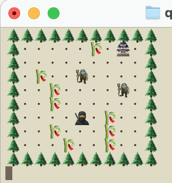

# Ghostblade: Shinobi Gauntlet
A command-line maze adventure game written in Rust



*(Temporary image)*

## About
Ghostblade is a stealth-based maze crawler where you play as a ninja infiltrating a heavily guarded castle. Navigate through increasingly complex levels, avoid patrols, and use various tools and mechanics to reach the objective.

## Features
- 10 handcrafted levels with increasing difficulty
- Command-line interface with ASCII/Emoji graphics
- Multiple maze mechanics:
    - Patrol guards with different movement patterns
    - Locked doors and keys
    - Hidden paths
    - Grappling hook movement
    - Drawbridges and other environmental interactions

## Installation
```bash
# Clone the repository
git clone https://github.com/planetaska/ghostblade.git

# Build the project
cd ghostblade
cargo build --release

# Run the game
cargo run --release
```

## How to Play
- Use `WASD` or arrow keys to move
- `E` to interact with objects
- `Space` to use special abilities
- `Q` to quit current level
- `Esc` to exit game

### Map Legend
```
🥷 - Player
🌲 - Wall
・ - Empty space
🏯 - Goal
🧌 - Patrol guard
🗝️ - Key
🚪 - Door
🪝 - Hook point
🪵 - Bridge
```

## Development
The game is written in Rust and uses simple text files for map layouts. Each map is defined in a `.txt` file in the `maps/` directory.

### Map Format
```
# Example map file
ttttttttttt
tsssssbsdst
tssssssesst
tsbsssssset
tssssssbsst
tssbsssbsst
tspsbssbsst
ttttttttttt
```

## Contributing
This is a personal study project. However, if you'd like to create your own version of the game, please feel free to fork this repository.

## License
This project is licensed under the MIT License - see the [LICENSE](LICENSE) file for details.

## Acknowledgments
- Inspired by classic games like Legend of Zelda and Crystalis
- Originally prototyped in Ruby during university studies
- Special thanks to my professor Barton Massey

## Roadmap
- [ ] Basic movement and collision
- [ ] Level loading system
- [ ] Patrol AI
- [ ] Key/door mechanics
- [ ] Grappling hook system
- [ ] Bridge mechanics
- [ ] 10 complete levels
- [ ] Map editor (stretch goal)

## Contact
- GitHub: [@planetaska](https://github.com/planetaska)
- Email: planetaska@gmail.com

---
*Note: This project is currently under development. Features and documentation may change.*
