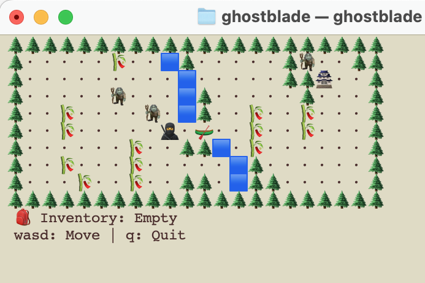

# Ghostblade: Shinobi Gauntlet
Ghostblade is a command-line maze adventure game written in Rust



## About
Ghostblade is a stealth-based maze crawler where you play as a ninja (Ghostblade) infiltrating a heavily guarded castle. Navigate through increasingly complex levels, avoid patrols, and use various tools and mechanics to reach the objective.

## Features
- 10 handcrafted levels with increasing difficulty
- Command-line interface with ASCII/Emoji graphics
- Multiple maze mechanics:
    - Patrol guards with different movement patterns
    - Locked doors and keys
    - Hidden paths
    - Various environmental interactions

## Installation
```bash
# Clone the repository
git clone https://github.com/planetaska/ghostblade.git

# Build the project
cd ghostblade
cargo build --release

# Run the game
cargo run --release
```

## Terminal Unicode Width Concerns
Emojis may appear as half-width due to Unicode classifications, terminal behavior, or font rendering differences.
To ensure consistent display, this program uses the Zero Width Space (`\u{200B}`) to adjust emoji width in certain terminals and fonts.
In most cases, this should not cause issues.
However, if the screen appears misaligned, try changing the terminal font for better compatibility.

## How to Play
- Use `WASD` keys to move
- `Q` to quit the game

### Map Legend

*showing only a few examples

```
🥷 - Player
🌲 - Wall
・ - Empty space
🏯 - Goal
🧌 - Patrol guard
🗝️ - Key
🚪 - Door
🪝 - Hook
⚓️ - Hook point
🪓 - Axe
🪵 - Woodlog for building Canoe 🛶
```

## Development
The game is written in Rust and uses simple text files for map layouts.

Each map is defined in a `.txt` file in the `maps/` directory.

### Map Format
```
# Example map file
ttttttttttt
tsssssbsdst
tssssssesst
tsbsssssset
tssssssbsst
tssbsssbsst
tspsbssbsst
ttttttttttt
```

### Map Customization

You can modify existing maps or create new ones by editing or adding a map file.
If you add a new map, be sure to update the `max_levels` value in `game.rb`.

## Contributing
This is a personal study project. However, if you'd like to create your own version of the game, please feel free to fork this repository.

## License
This project is licensed under the MIT License - see the [LICENSE](LICENSE) file for details.

## Acknowledgments
- Inspired by classic games like Legend of Zelda and Crystalis
- Originally prototyped in Ruby during university studies
- Special thanks to my professor Barton Massey

## Roadmap
- [x] Basic movement and collision
- [x] Level loading system
- [x] Patrol AI
- [x] Key/door mechanics
- [x] Grappling hook system
- [x] Bridge mechanics
- [x] 10 complete levels
- [ ] ~~Map editor~~ (stretch goal)

## Contact
- GitHub: [@planetaska](https://github.com/planetaska)
- Email: planetaska@gmail.com

---
*Note: This project is currently under development. Features and documentation may change.*
